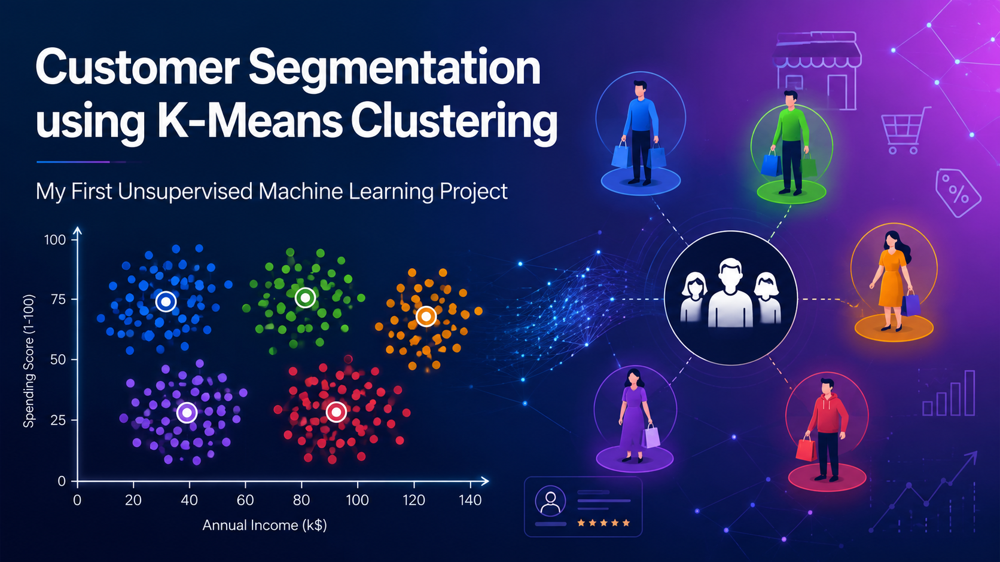
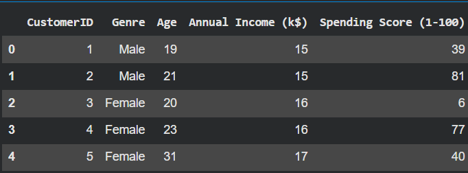
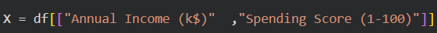
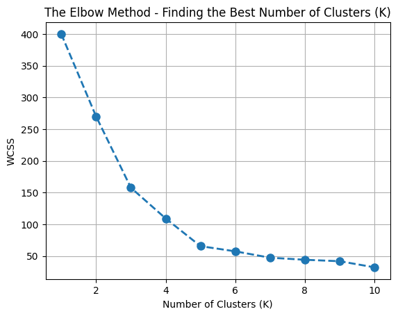
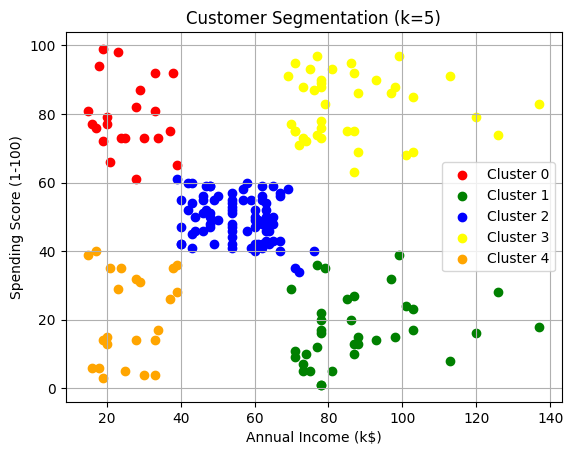
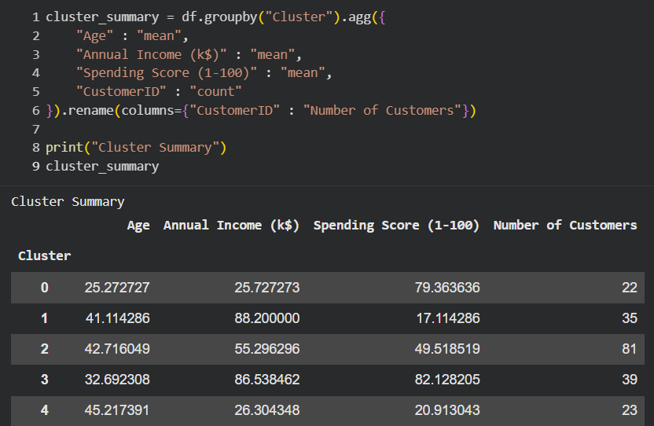

# Customer Segmentation using K-Means Clustering

<p align="center">
  
</p>

<p align="center">


</p>

---

# 📌 Project Overview

Customer segmentation is one of the most important applications of Machine Learning in business analytics. Instead of treating every customer the same, businesses can group customers with similar purchasing behavior and design personalized marketing strategies.

This project implements the **K-Means Clustering** algorithm to segment mall customers based on their **Annual Income** and **Spending Score**. Since customer labels are unavailable, the problem is solved using **Unsupervised Machine Learning**.

The project demonstrates the complete clustering workflow—from data preprocessing and feature selection to determining the optimal number of clusters using the **Elbow Method** and visualizing the final customer groups.

---

# 🎯 Objectives

- Understand the concept of Unsupervised Machine Learning.
- Explore and preprocess the dataset.
- Select the most relevant features.
- Standardize the selected features using StandardScaler.
- Determine the optimal number of clusters using the Elbow Method.
- Train the K-Means clustering model.
- Assign cluster labels to each customer.
- Visualize customer clusters.
- Analyze the cluster summary.

---

# 📂 Dataset

**Dataset:** Mall Customers Dataset

The dataset contains customer demographic and spending information collected from a shopping mall.

### Features

- CustomerID
- Gender
- Age
- Annual Income (k$)
- Spending Score (1–100)

### Features Used for Clustering

- Annual Income (k$)
- Spending Score (1–100)

---

# 🛠 Technologies Used

- Python
- Jupyter Notebook
- Pandas
- NumPy
- Matplotlib
- Scikit-learn

---

# 🚀 Project Workflow

1. Import the required libraries.
2. Load the dataset.
3. Explore the dataset.
4. Select the relevant features.
5. Standardize the selected features using **StandardScaler**.
6. Apply the Elbow Method to determine the optimal value of **K**.
7. Train the K-Means clustering model.
8. Assign cluster labels to each customer.
9. Visualize the customer clusters.
10. Analyze the cluster summary.

---

# 📸 Project Screenshots

## Dataset Preview



---

## Feature Selection



---

## Elbow Method



---

## Customer Clusters



---

## Cluster Summary



---

# 📊 Results

The Elbow Method indicated that **5** was the optimal number of clusters for this dataset.

Using the K-Means algorithm, customers were successfully grouped into five distinct clusters based on their **Annual Income** and **Spending Score**.

These clusters help businesses:

- Identify high-value customers.
- Understand customer purchasing behavior.
- Design targeted marketing campaigns.
- Improve customer engagement.
- Support data-driven business decisions.

---

# 📚 Learning Outcomes

Through this project, I learned:

- Fundamentals of Unsupervised Machine Learning.
- Data preprocessing using StandardScaler.
- Feature selection for clustering.
- Determining the optimal number of clusters using the Elbow Method.
- Implementing K-Means Clustering using Scikit-learn.
- Visualizing and interpreting clustering results.
- Applying Machine Learning techniques to solve real-world business problems.

---

# ▶️ How to Run the Project

## 1. Clone the Repository

```bash
git clone https://github.com/YOUR_GITHUB_USERNAME/Customer-Segmentation-Using-KMeans.git
```

## 2. Navigate to the Project Folder

```bash
cd Customer-Segmentation-Using-KMeans
```

## 3. Install Required Libraries

```bash
pip install -r requirements.txt
```

## 4. Launch Jupyter Notebook

```bash
jupyter notebook Customer_Segmentation.ipynb
```

---

# 📁 Project Structure

```text
Customer-Segmentation-Using-KMeans
│
├── Customer_Segmentation.ipynb
├── Mall_Customers.csv
├── requirements.txt
├── README.md
│
└── images
    ├── Cover.png
    ├── Dataset_preview.png
    ├── feature_selection.png
    ├── ELbow Method.png
    ├── Clusters.png
    └── Cluster_summary.png
```

---

# 🔮 Future Improvements

- Compare K-Means with Hierarchical Clustering and DBSCAN.
- Use additional customer features for clustering.
- Evaluate clustering performance using different validation metrics.
- Build an interactive dashboard using Streamlit.
- Deploy the project as a web application.

---

# 🙏 Acknowledgements

- Mall Customers Dataset
- Scikit-learn Documentation
- Pandas Documentation
- NumPy Documentation
- Matplotlib Documentation

---

# 👩‍💻 Author

**ruthushreeanoor**

Computer Science Engineering Student

Interested in Machine Learning, Artificial Intelligence, Data Science, and Python Development.

---

## ⭐ Support

If you found this project helpful, consider giving it a ⭐ on GitHub.
